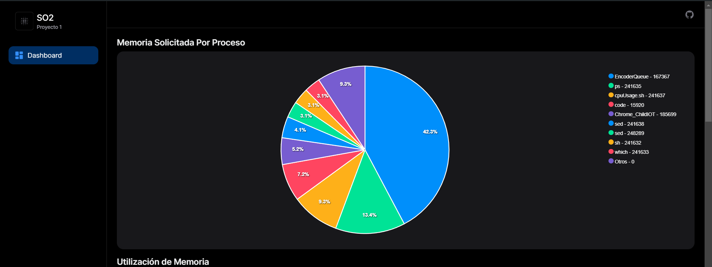

# Manual Técnico - Proyecto 1

## Indice

- [Requerimientos del sistema](#requerimientos-del-sistema)
- [Instalación](#instalación)
- [Compilación del programa](#compilacion-del-programa)
- [Ejecución del programa](#ejecucion-del-programa)
- [App](#app)

## Requerimientos del sistema
- Stap
- Docker
- gcc (compilador)
- Node.js

## Instalación

### Stap
Para instalar Stap, siga los pasos descritos en el [sitio oficial](https://sourceware.org/systemtap/wiki/InstallingStap).
Para instalar Node.js, siga los pasos descritos en el [sitio oficial](https://nodejs.org/en/download/).

### Docker
Siga los pasos descritos en el [sitio oficial](https://docs.docker.com/install/).

### gcc (compilador)
Siga los pasos descritos en el [sitio oficial](https://gcc.gnu.org/install/).

### Node.js
Siga los pasos descritos en el [sitio oficial](https://nodejs.org/en/download/).

## Compilación del programa

El programa se compila con el siguiente comando:

```bash
gcc -o programa main.c -lmysqlclient
```

## Ejecución del programa

### Documentación del Código en C

Este documento describe el funcionamiento y los detalles del código en C proporcionado. Este código se encarga de ejecutar un script con `sudo`, capturar su salida y almacenar ciertos datos en una base de datos MySQL.

### Bibliotecas Incluidas

```c
#include <stdio.h>
#include <stdlib.h>
#include <string.h>
#include <mysql/mysql.h>
```

Las bibliotecas incluidas proporcionan funciones para entrada/salida estándar, gestión de memoria, manipulación de cadenas y conexión con una base de datos MySQL.

### Definición de Constantes

```c
#define MAX_LINE_LENGTH 256
```

Se define una constante `MAX_LINE_LENGTH` que establece el tamaño máximo para las líneas leídas del archivo.

### Función Principal

```c
int main() {
```

#### Variables y Comandos

```c
const char *command = "sudo stap memory_requests.stp";
FILE *fp = popen(command, "r");
```

- `command` contiene el comando que se ejecutará con `sudo`.
- `fp` es un puntero a un archivo que se abre usando `popen` para ejecutar el comando.

#### Manejo de Errores al Abrir el Proceso

```c
if (fp == NULL) {
    perror("Error abriendo el proceso con sudo");
    return 1;
}
```

Se verifica si el archivo se abre correctamente. En caso de error, se muestra un mensaje y se termina el programa.

#### Conexión a la Base de Datos

```c
MYSQL *conn;
MYSQL_RES *res;
MYSQL_ROW row;
const char *server = "roundhouse.proxy.rlwy.net";
const char *user = "root";
const char *password = "fIfkYvtSvlmpSptMUpqxrmtBemKzoizk";
const char *database = "so2p1";
unsigned int port = 37220;

conn = mysql_init(NULL);
if (conn == NULL) {
    fprintf(stderr, "Error al inicializar la conexión: %s\n", mysql_error(conn));
    return 1;
}

if (mysql_real_connect(conn, server, user, password, database, port, NULL, 0) == NULL) {
    fprintf(stderr, "Error al conectar con la base de datos: %s\n", mysql_error(conn));
    mysql_close(conn);
    return 1;
}
```

- Se inicializa una conexión MySQL y se intentan conectar a la base de datos.
- Si hay errores en la conexión, se muestra un mensaje y se cierra la conexión.

#### Lectura y Procesamiento de la Salida del Comando

```c
char line[MAX_LINE_LENGTH];

while (fgets(line, sizeof(line), fp) != NULL) {
    char *ismmap = strtok(line, ",");
    char *pid = strtok(NULL, ",");
    char *execname = strtok(NULL, ",");
    char *gettimeofday_s = strtok(NULL, ",");
    char *length = strtok(NULL, ",");

    if (ismmap == NULL || pid == NULL || execname == NULL || gettimeofday_s == NULL || length == NULL) {
        continue;
    }

    long pid_val = atol(pid);
    long unix_time_val = atol(gettimeofday_s);
    long size = atol(length);

    int is_mmap_val = atoi(ismmap);
```

- Se lee la salida del comando línea por línea.
- Se usan `strtok` para dividir la línea en tokens separados por comas.
- Se validan los tokens y se convierten a los tipos de datos correspondientes.

#### Inserción de Datos en la Base de Datos

```c
    char query[MAX_LINE_LENGTH];
    sprintf(query, "INSERT INTO memory_requests (pid, process_name, is_mmap, unix_time, size) VALUES (%ld, '%s', %d, %ld, %ld)",
            pid_val, execname, is_mmap_val, unix_time_val, size);

    if (mysql_query(conn, query)) {
        fprintf(stderr, "Error al ejecutar la consulta: %s\n", mysql_error(conn));
    } else {
        printf("Se insertó correctamente el registro\n");
    }
}
```

- Se construye una consulta SQL para insertar los datos en la tabla `memory_requests`.
- Si la consulta falla, se muestra un mensaje de error.

#### Cierre de Conexiones y Archivos

```c
mysql_close(conn);
pclose(fp);

return 0;
}
```

- Se cierra la conexión a la base de datos y el archivo.
- El programa termina exitosamente.

#### Notas Adicionales

- Asegúrese de tener las bibliotecas MySQL instaladas y configuradas en su entorno.
- La seguridad de las credenciales de la base de datos debe ser considerada, y se recomienda no incluirlas directamente en el código fuente en un entorno de producción.

## App

### Instalación de dependencias

La aplicación se divide en 3 partes:

1. Visualización de datos en la base de datos: Esta parte se encarga de mostrar los datos almacenados en la base de datos en una tabla de forma organizada y legible. La información que se presenta incluye: pid, proceso, tipo de memoria y tamaño solicitado.



2. Tabla de últimas solicitudes: Esta parte se encarga de mostrar las últimas solicitudes de memoria en la base de datos. La información que se presenta incluye: pid, proceso, tipo de memoria y tamaño solicitado.


3. Tabla de utilización de memoria: Esta parte se encarga de mostrar la utilización de memoria en la base de datos. La información que se presenta incluye: pid, proceso, tipo de memoria y tamaño solicitado.


